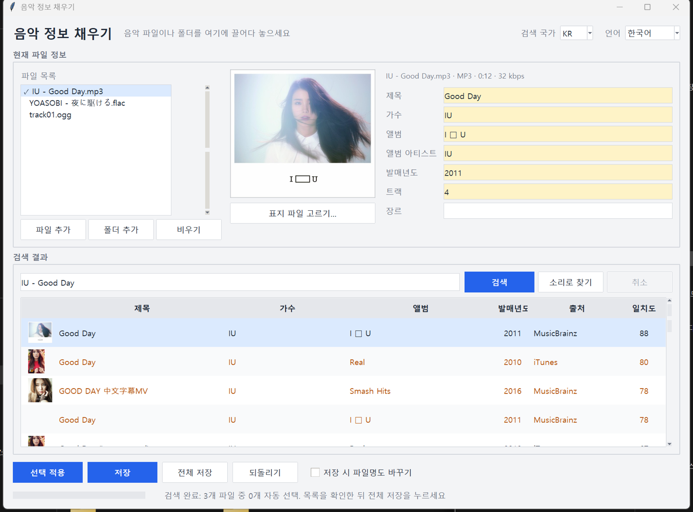

# Music Tag Filler (음악 정보 채우기)


[한국어](README.md) · [中文](README.zh-CN.md) · [日本語](README.ja.md)

> **Your files are never uploaded.** Only the search query and an audio fingerprint (a string of numbers) are sent.

Drop mp3 / flac / m4a / ogg files with missing title, artist, album or cover art. The top half shows what the file contains, the bottom half shows candidates from iTunes, MusicBrainz and AcoustID, and the one you pick is written into the file. No server, no install, nothing is touched before you press Save.



## Download

- **Executable**: grab `music-tag-filler.exe` from [Releases](https://github.com/microhan1/music-tag-filler/releases) and double-click it. Nothing to install. (The exe is unsigned; if SmartScreen warns, choose "More info → Run anyway".)
- **Run from source**:

```bash
pip install -r requirements.txt
python main.py
```

## Usage

1. Drop music files or a folder onto the window. `Artist - Title` is read from the file name and the search starts right away.
2. Pick a candidate in the table and press **Apply selected** (or double-click). Changed fields turn yellow; you can edit them by hand.
3. Press **Save**. The original tags are kept in `<file>.tagbak.json`, and **Undo** restores the file byte for byte.

With several files, each one is searched and the first candidate scoring 90 or more is pre-selected (grey check). Step through the list, then press **Save all**. For files with no usable name such as `track01.mp3`, press **Find by sound**.

**Batch cover**: with several files loaded (an album folder, say), a **Use this cover for all** button appears under the cover preview.

1. Select a file that has a cover. A cover you applied from a candidate, picked with **Pick cover image**, or dropped onto the cover area counts too.
2. Press **Use this cover for all** and confirm; every other file in the list gets the same cover.
3. Press **Save all** to write it to the files. Undo still works file by file.

```bash
python main.py song.mp3                      # lists numbered candidates and asks
python main.py music_folder --auto --rename  # saves without asking at match >= 90, renames too
python main.py song.mp3 --undo               # restores the original tags from the backup
```

`python main.py --help` prints the options in your OS language (한국어 · English · 中文 · 日本語).

The exe accepts the same arguments (`music-tag-filler.exe song.mp3 --auto`). It is built as a windowed app, so in some environments the console shows no output; redirect it to a file (`> log.txt`) or run from source. With arguments but no console to print to, the window opens with those files loaded.

Tests: `pip install -r requirements-dev.txt`, then `python -m pytest tests`. Fixtures come from the audio in `samples/`.

## Artist identifiers

So that the same artist saved as `岡田 有希子`, `岡田有希子` or `Yukiko Okada` can later be grouped as one, saving writes identifiers next to the display names. Tag names match MusicBrainz Picard, so other tools read them.

| What | mp3 | flac · ogg | m4a |
| --- | --- | --- | --- |
| MusicBrainz artist ID | `TXXX:MusicBrainz Artist Id` | `MUSICBRAINZ_ARTISTID` | `MusicBrainz Artist Id` |
| Album artist ID | `TXXX:MusicBrainz Album Artist Id` | `MUSICBRAINZ_ALBUMARTISTID` | `MusicBrainz Album Artist Id` |
| Album (release) ID | `TXXX:MusicBrainz Album Id` | `MUSICBRAINZ_ALBUMID` | `MusicBrainz Album Id` |
| Recording ID | `UFID:http://musicbrainz.org` | `MUSICBRAINZ_TRACKID` | `MusicBrainz Track Id` |
| Sort name (e.g. `Okada, Yukiko`) | `TSOP`, `TSO2` | `ARTISTSORT`, `ALBUMARTISTSORT` | `soar`, `soaa` |
| iTunes artist ID | `TXXX:iTunes Artist Id` | `ITUNES_ARTISTID` | `iTunes Artist Id` |

- Applying a MusicBrainz candidate writes the MusicBrainz IDs and sort names; an iTunes candidate writes the iTunes artist ID; a merged candidate writes both.
- Several credited artists give several IDs (joined by `/` in mp3). Auto-selected files get them too.
- The "Identifiers" line under the fields shows what a file has. Undo restores the identifiers as well.
- The display name is the candidate's own. Set `artist_name_preference` to `"latin"` in `settings.json` to use a Latin-script name when MusicBrainz clearly provides one (default `"original"`).

## After the tags: organize the folders

Once the tags are filled, [Music Folder Organizer](https://github.com/microhan1/music-folder-organizer) moves the files into `Artist/Album/01 - Title.mp3` folders and sorts out duplicates. It works offline, shows a preview before anything moves, and can undo every run.

- The MusicBrainz and iTunes artist IDs written here let it put spellings such as `岡田 有希子` and `岡田有希子` into one folder (Music Folder Organizer v0.1.2+), and the sort names are available as `{artist_sort}` in its folder pattern.
- This tool's backups (`<file>.tagbak.json`) move along with the music, so **Undo** here still works after the folders are reorganized.

## Find by sound setup

- `third_party/fpcalc.exe` (Chromaprint) is bundled in the repository. If missing, download `chromaprint-fpcalc-*-windows-x86_64.zip` from [Chromaprint Releases](https://github.com/acoustid/chromaprint/releases) and put `fpcalc.exe` in `third_party/`, or set `fpcalc_path` in `settings.json`.
- The exe from Releases carries an AcoustID application key and works as is. When running from source, register a free key at [acoustid.org/new-application](https://acoustid.org/new-application) and put it in `acoustid_key` in `settings.json`, or in a one-line `acoustid_key.txt` (never committed) that build.bat bundles into the exe.

## Data sources

| Source | Used for | Terms |
| --- | --- | --- |
| [iTunes Search API](https://performance-partners.apple.com/search-api) | songs, albums, cover art | [Apple Media Services terms](https://www.apple.com/legal/internet-services/itunes/) |
| [MusicBrainz](https://musicbrainz.org/) | songs, albums, release data | [MusicBrainz API rules](https://musicbrainz.org/doc/MusicBrainz_API/Rate_Limiting) |
| [AcoustID](https://acoustid.org/) | fingerprint → recording ID | [AcoustID web service terms](https://acoustid.org/webservice) |
| [Cover Art Archive](https://coverartarchive.org/) | album covers | [About the CAA](https://musicbrainz.org/doc/Cover_Art_Archive) |

The Korean iTunes storefront sells no music and returns nothing, so when the chosen country has no results the US store is tried automatically. Titles and artist names are shown exactly as the source returns them.

## What it does not do

- Never uploads a music file anywhere. Only the query and the fingerprint are sent.
- No lyrics.
- No downloading, converting or playing music.
- No streaming-service accounts.
- No scraping of services without an official API (Melon, Bugs, Genie, ...).
- Nothing is written before you press Save.

## Compared with MusicBrainz Picard

- No setup: drop, pick, save.
- iTunes search alongside MusicBrainz makes it strong for K-pop, J-pop, Chinese music and cover art.
- Korean UI by default, switchable to English, Chinese and Japanese.

## License

MIT. See [LICENSE](LICENSE).
The bundled `third_party/fpcalc.exe` (Chromaprint) is LGPL-2.1; the text is in [third_party/LICENSE-chromaprint](third_party/LICENSE-chromaprint).
