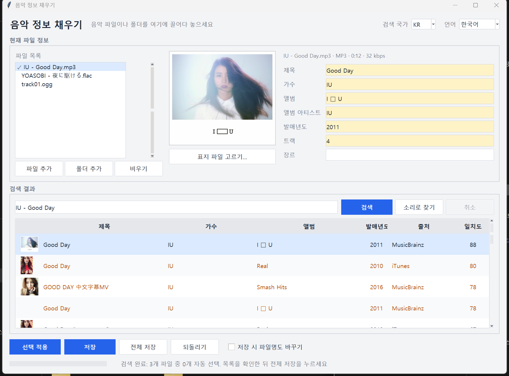

# 音乐标签补全 (Music Tag Filler)

[한국어](README.md) · [English](README.en.md) · [日本語](README.ja.md)

> **文件不会上传到互联网。** 只发送搜索关键词和声音指纹（一串数字）。

把缺少标题、歌手、专辑或封面的 mp3 / flac / m4a / ogg 拖进来：上半部分显示文件里已有的信息，下半部分显示从 iTunes、MusicBrainz、AcoustID 找到的候选，选中后写入文件。无服务器，无需安装，按下保存之前不会改动文件。



## 下载

- **可执行文件**：在 [Releases](https://github.com/microhan1/music-tag-filler/releases) 下载 `music-tag-filler.exe` 并双击运行，无需安装。（exe 未签名，若 SmartScreen 提示，请选择"更多信息 → 仍要运行"。）
- **从源码运行**：

```bash
pip install -r requirements.txt
python main.py
```

## 使用方法

1. 把音乐文件或文件夹拖到窗口上。程序会从文件名读取 `歌手 - 标题` 并立即开始搜索。
2. 在下方表格中选择候选，点击**应用所选**（或双击）。改动的字段显示为黄色，也可以手动修改。
3. 点击**保存**。原始标签保存在 `<文件名>.tagbak.json` 中，**撤销**可将文件逐字节恢复原状。

放入多个文件时，每个文件都会搜索，匹配度 90 以上的第一个候选会被自动选中（灰色勾）。逐个检查后点击**全部保存**。对 `track01.mp3` 这类没有有效文件名的文件，请点击**按声音查找**。

```bash
python main.py song.mp3                      # 列出带编号的候选并询问
python main.py music_folder --auto --rename  # 匹配度 >= 90 时不询问直接保存，并重命名
python main.py song.mp3 --undo               # 从备份恢复原始标签
```

`python main.py --help` 会用操作系统语言（한국어 · English · 中文 · 日本語）显示选项。

## 按声音查找的准备

- 需要 `third_party/fpcalc.exe`（Chromaprint），仓库已附带。若缺失，请从 [Chromaprint Releases](https://github.com/acoustid/chromaprint/releases) 下载 `chromaprint-fpcalc-*-windows-x86_64.zip`，把 `fpcalc.exe` 放入 `third_party/`，或在 `settings.json` 的 `fpcalc_path` 中填写路径。
- Releases 中的 exe 已内置 AcoustID 应用密钥，可直接使用。从源码运行时，请在 [acoustid.org/new-application](https://acoustid.org/new-application) 免费申请密钥，填入 `settings.json` 的 `acoustid_key`，或写入单行文件 `acoustid_key.txt`（不会提交到仓库），build.bat 会把它打包进 exe。

## 信息来源

| 来源 | 用途 | 条款 |
| --- | --- | --- |
| [iTunes Search API](https://performance-partners.apple.com/search-api) | 歌曲、专辑、封面 | [Apple Media Services 条款](https://www.apple.com/legal/internet-services/itunes/) |
| [MusicBrainz](https://musicbrainz.org/) | 歌曲、专辑、发行信息 | [MusicBrainz API 规则](https://musicbrainz.org/doc/MusicBrainz_API/Rate_Limiting) |
| [AcoustID](https://acoustid.org/) | 声音指纹 → 录音 ID | [AcoustID 服务条款](https://acoustid.org/webservice) |
| [Cover Art Archive](https://coverartarchive.org/) | 专辑封面 | [关于 CAA](https://musicbrainz.org/doc/Cover_Art_Archive) |

iTunes 韩国商店不销售音乐，搜索结果总是为空，因此所选国家没有结果时会自动改用美国商店。歌名和歌手名按来源返回的原文显示。

## 不做的事

- 不会把音乐文件上传到任何地方，只发送关键词和声音指纹。
- 不获取歌词。
- 没有下载、转换、播放功能。
- 不关联流媒体账户。
- 不抓取没有官方 API 的服务（Melon、Bugs、Genie 等）。
- 按下保存之前不会改动文件。

## 与 MusicBrainz Picard 的区别

- 无需设置："拖入、选择、保存"三步完成。
- 同时使用 iTunes 搜索，对韩语、日语、华语音乐和封面更有效。
- 默认韩语界面，可随时切换为英语、中文、日语。

## 许可证

MIT，见 [LICENSE](LICENSE)。
附带的 `third_party/fpcalc.exe`（Chromaprint）为 LGPL-2.1，全文见 [third_party/LICENSE-chromaprint](third_party/LICENSE-chromaprint)。
